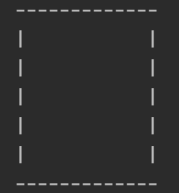

# TicTacToe
Thank you for checking out my project. Here you can find a few instructions on how to 
install and play the game on your device.

# Installation instruction:
Step 1: You need a working IDE to run the game. There are a few options of IDE out there
for you, but I highly recommend using either Eclipse or IntelliJ. The instructions on how to install them are listed below.
        Eclipse: https://www.ntu.edu.sg/home/ehchua/programming/howto/EclipseJava_HowTo.html
        Intellij: https://www.jetbrains.com/help/idea/installation-guide.html
        
Step 2: After your IDE is installed and ready to go, you can go ahead and create a project. Once your project is created, 
find VCS on the main menu on top of your screen, and choose Git as the version control system and click OK.

Step 3: Copy this link (https://github.com/BenPhan777/TicTacToe.git") without the brackets. After that, you can go back to
your project and follow these steps.
        - Click on VCS again.
        - Click on git.
        - Click on Clone...
        - Paste the link you copied earlier to the URL box, and click Clone.
        
Step 4: You now have a copy of my project. The next step is to run it. You can simply do that by finding Run on the main menu
on top of your screen, click on it, and click on the green triangle icon with "Run..." next to it. A pop-up will appear
and ask you to choose something to run. There should be a TicTacToe option, you just need to double click on it. The game
will then appear on the bottom of IntelliJ.

# How to play:
- If you already got everything installed and ready to go, this part is easy. If your program is running like it's supposed to,
you should see a text saying "Enter the size of the board game here: ". All you need to do is click on the empty spot
after "here: " and enter a board size from your keyboard. 
For example: > Enter the size of the board game here: 5
- And you can keep doing that for any other texts that appear after you hit enter.
- As for how to play the game, depending on which size of board you chose, an empty board of that size will appear. 

- There will also be a text asking you to enter the coordinate. To enter the right coordinate, first, you need to understand
the coordinate of this board game. Start at the bottom left, that coordinate will be (1, 1). The first number represents x, and
the second number represents y. So if you want to go right by 1, you need to enter (2, 1). Here is an example coordinate of a
3x3 board game. Note that the coordinate will increase as the board size increases.

- To enter the coordinate, you need to type the x-coordinate follows by a space and the y-coordinate. 
For example, this is how I enter my (1, 1) coordinate after the text:
                > Enter the coordinate of your move here (example: 2 3): 1 1
- If you followed my instruction correctly, a new board should appear with your move on it like this:
-------------
|           |
|           |
|           |
|           |
| X         |
-------------
- The game will continue until someone wins or if there is a draw. Once that happens, there should be a text asking you if you
want to play again. Simply enter y if you want to continue or n if you want to stop. 
- Voila! You should be able to play the game now with your friends.
